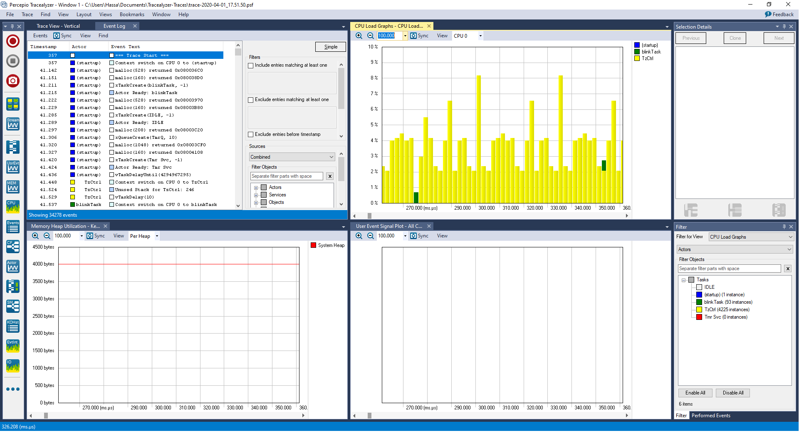
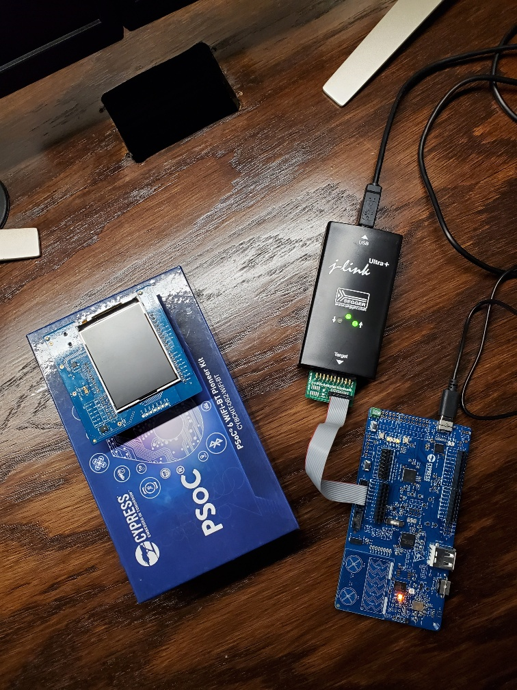
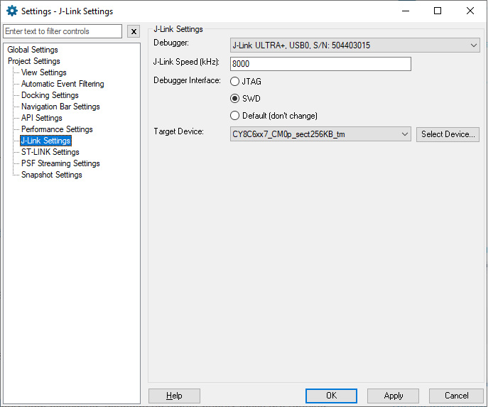
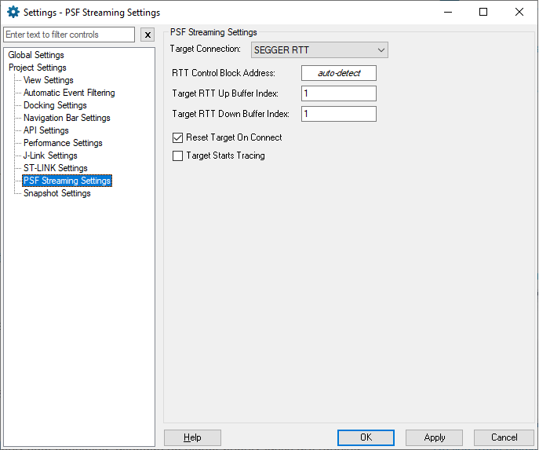

 
 
 
 
 

### P6FreeRTOSTickless with Percipio Tracealyzer

  

### About the project
___
Everytime I start a project with a MCU that has any umf, I find myself wanting an RTOS half way as I build function upon function. For sure bad planning on my part, but when I'm tinckering, it's about the learning and the trying and the debugging. IoTExpert has made it easier by providing a nice template for the PSoC 6 series of MCUs from Cypress, with FreeRTOS and the added bonus of a tickless mode implementation for low power operation. You can find the original post here: https://github.com/iotexpert/P6FreeRTOSTickless.

This project was originally forked from tthat template, and modified to add the Percipio Tracealyzer capability which I find myself needing again, halfway through the project usually.
Project was tested for both Streaming and Snapshot modes supported in Tracealyzer, and was updated to ModusToolbox 2.1.

### Built With
___

IDE: ModusToolbox 2.0 IDE
Hardware: CY8CKIT-062-Wi-Fi-BT

### Getting Started
___

#### Using this project
Fork the repo or clone, and get started with the main.c by adding your code. Make sure the Jlink is active and updated with the latest drivers. You need to have an approved version of [Percipio Tracealyzer](https://percepio.com/tracealyzer/ "Percipio Tracealyzer").

  

#### Adding to your project
If you choose to start from a new project, or wish to add the functionality to your own project, follow the steps highlighted in the [Integration Guide](https://percepio.com/docs/FreeRTOS/manual/index.html#Creating_and_Loading_Traces___Percepio_Trace_Recorder___FreeRTOS___Integrating_the_Recorder "Integration Guide").
You will need to make sure you add the following line to your `SEGGER_RTT_Conf.h` file to make sure the Jlink is able to find the RAM address for your project:

    #define SEGGER_RTT_SECTION ".bss.ram"

With these additions and the changes outlined in the quick start guide, the project should work. the settings of the Jlink within the Percipio Tracealyzer tool need to be as shown below to work with the PSoC 6:

#### Jlink Settings

  

  

### Contributing
___
Contributions are what make the open source community such an amazing place to be learn, inspire, and create. Any contributions you make are **greatly appreciated**.

1. Fork the Project
2. Create your Feature Branch (`git checkout -b feature/AmazingFeature`)
3. Commit your Changes (`git commit -m 'Add some AmazingFeature'`)
4. Push to the Branch (`git push origin feature/AmazingFeature`)
5. Open a Pull Request

### License
___
Distributed under the MIT License. See `LICENSE` for more information.

### Contact
___
Project Link: [P6FreeRTOS w/ Tracealyzer](https://github.com/HElkhoury/P6FreeRTOSTickless)

### Acknowledgements
___
* [Img Shields](https://shields.io)
* [Choose an Open Source License](https://choosealicense.com)
* [GitHub Pages](https://pages.github.com)
* [IoTExpert](https://iotexpert.com/)

### End
